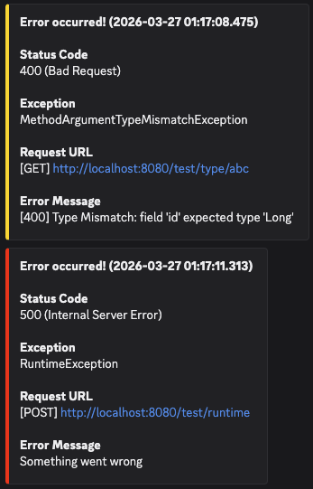

# Errorping

<div align="center">

</div>

## About The Project

Errorping is a lightweight library for Spring Boot that sends detailed error logs
via Discord webhooks in real-time.

### Built With

- Spring Boot 3.5.4
- JDK 17
- Servlet-based stack (`spring-boot-starter-web`)

### Features

- **Discord Webhook Integration**: Sends highly readable Embed messages including status codes, request URL, and
  exception class.
- **Ready-to-use Templates**: Provides a pre-configured GlobalExceptionHandler and Logback configuration for immediate
  integration.
- **Easy Configuration**: Enable Discord alerting simply via application.yml without any additional code modifications.

## Installation

### Option 1: Maven Local (Recommended for development)

In the `errorping` project:

```bash
./gradlew publishToMavenLocal
```

Then, in your application:

```gradle
dependencies {
    implementation "com.jhssong:errorping:0.0.0-SNAPSHOT"
}
```

### Option 2: GitHub Packages (Recommended for production)

Check most recent version at [here](https://github.com/jhssong/errorping/tags)

```gradle
repositories {
    maven {
        url = uri("https://maven.pkg.github.com/jhssong/errorping")
        credentials {
            username = project.findProperty("gpr.user")
            password = project.findProperty("gpr.key")
        }
    }
}

dependencies {
    implementation "com.jhssong:errorping:1.0.0"
}
```

> GitHub Packages requires authentication even for public repositories.

## Configuration

Errorping uses Spring Boot `@ConfigurationProperties` to load alert-related settings.
To enable Discord alerting, add the following to your `application.yml`:

```yaml
errorping:
  discord-webhook-url: ${DISCORD_WEBHOOK_URL}
```

### Alert Preview

<div>

</div>

### Example

For more examples, check [errorping-example](https://github.com/jhssong/errorping-example)